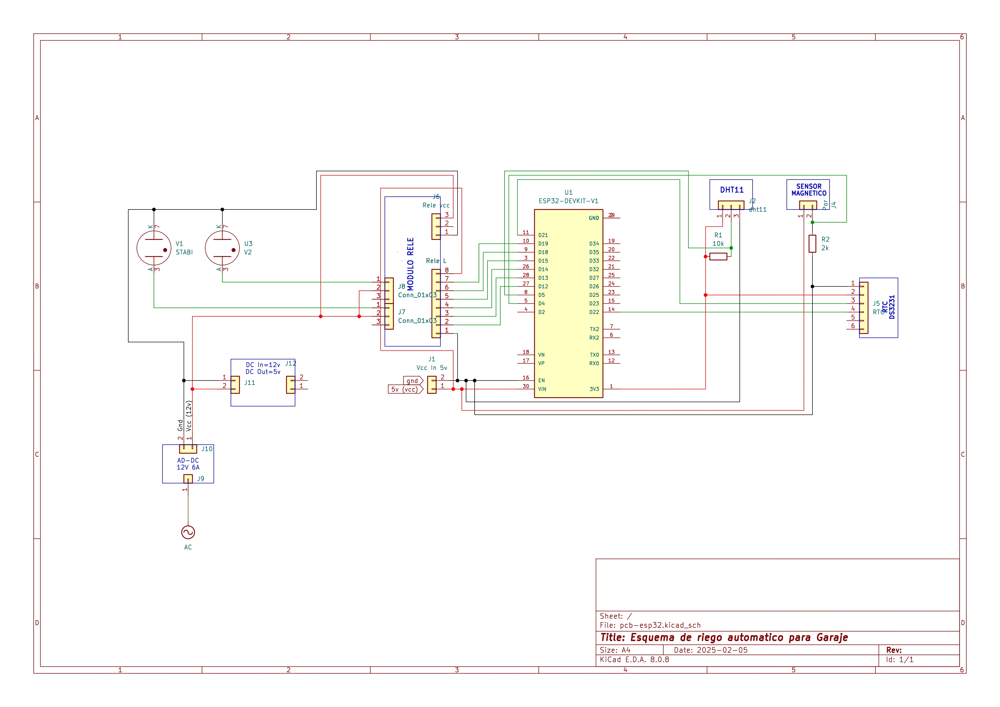

# ​🚿 ESP32 Smart Irrigation & Monitoring System
[🇪🇸 Leer en Español](README_es.md)

This project is designed to automate irrigation using an **ESP32 NodeMCU DevKit V1**, while also monitoring **temperature, humidity**, and the **garage door status**. The system will be controlled remotely via **Blynk or Arduino Cloud** and will keep track of time using an **RTC DS3231**.  

## 📖 **Project Overview**  

### ✅ **Short-Term Goals (Basic Functionality)**  
- Control two **electrovalves** using relays based on a **defined schedule**.  
- Measure **temperature and humidity** with a **DHT11** sensor.  
- Detect whether the **garage door is open or closed** using a **magnetic sensor**.  
- Use **Blynk** or **Arduino Cloud** for remote monitoring (adjusting readings every **10 seconds**).  
- Ensure the ESP32 gets the correct time from the **RTC DS3231** instead of relying on the internet.  

### 🔄 **Medium-Term Goals**  
- Implement **FreeRTOS** or utilize **both ESP32 cores** for multitasking.  
- Replace a **mechanical timer** in the garage with an ESP32-controlled relay.  
- Create a **web interface** to control the system without relying on Blynk or Arduino Cloud.  

### 🚀 **Long-Term Goals**  
- Explore the possibility of **AI integration** (e.g., **TinyML**).  
- Add additional sensors (**rain, wind, etc.**) to improve functionality.  

---

## 🛠️ **Hardware Components**  
| Component  | ESP32 PinOut |
|------------|----------|
| **Relay 1** | GPIO 13 |
| **Relay 2** | GPIO 14 |
| **Relay 3** | GPIO 12 |
| **Relay 4** | GPIO 15 |
| **Relay 5** | GPIO 19 |
| **Relay 6** | GPIO 18 |
| **Magnetic Sensor** | GPIO 4 |
| **DHT11 (Temperature & Humidity)** | GPIO 5 |
| **RTC DS3231 (SDA)** | GPIO 21 |
| **RTC DS3231 (SCL)** | GPIO 22 |

---

## 📂 **Project Structure**  
| ESP32-Smart-Irrigation  |
|-------------------------|
| |


## 🔒 **Keeping Credentials Secure**  
This project requires sensitive information like **WiFi credentials** and **Blynk API keys**. These are stored in `config.h`, which is **excluded from GitHub** using `.gitignore` to prevent public exposure.  

### Example of `config.h` (Do NOT upload to GitHub!)  
```cpp
#ifndef CONFIG_H
#define CONFIG_H

// WiFi Credentials
#define WIFI_SSID "YourSSID"
#define WIFI_PASSWORD "YourPassword"

// Blynk Key
#define BLYNK_TEMPLATE_ID "YourID"
#define BLYNK_TEMPLATE_NAME "YourName"

// ezTime Config
#define TIMEZONE "YourTimeZone" // In this format Pacific/NewZealand/Auckland

#endif
```

## 📌 **Getting Started**


1️⃣ Clone the Repository
```
git clone https://github.com/josetomas09/Smart-Irrigation.git
```
2️⃣ Set Up PlatformIO; Ensure you have PlatformIO installed in VSCode. Then, open the project and install required libraries.


3️⃣ Create Your Own config.h File; Create `config.h` file, and add your WiFi credentials and Blynk API key.


4️⃣ Compile and Upload to ESP32

## 📝 **Project Progress & Updates**

📅 February 2025:

- ✅ Hardware selection & wiring.
- ✅ Defined ESP32 pinout.
- ✅ Initial repository setup & documentation.


📅 Next Steps:


- ⏳ Implement basic sensor readings.
- ⏳ Develop relay control logic.
- ⏳ Integrate Blynk for remote monitoring.

## 🤝 **Contributing**
If you're interested in contributing, feel free to fork the repo and submit a pull request or contact me! (preferred language: spanish).


## 📜 **License**

*This project is open-source under the MIT License.*
