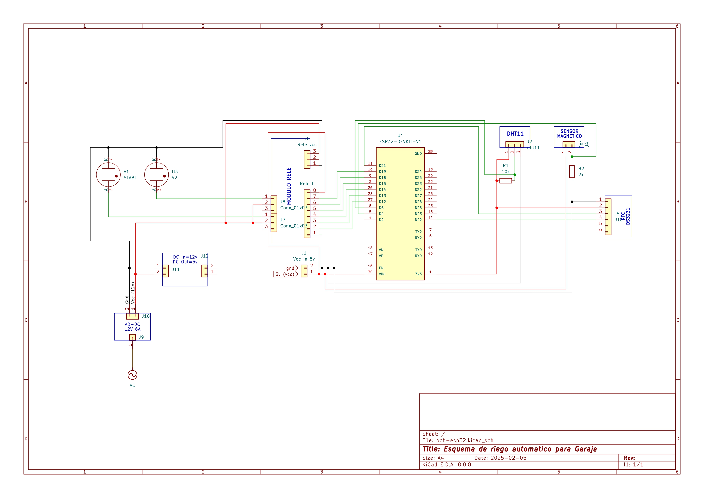

# ​🚿 ESP32 Sistema de Monitoreo y Riego Automatico
[🇬🇧 Read in English](README.md)  

Este proyecto está diseñado para automatizar el riego utilizando un **ESP32 NodeMCU DevKit V1**, mientras también monitorea la **temperatura, humedad** y el **estado del portón del garaje**. El sistema será controlado de forma remota mediante **Blynk o Arduino Cloud** y mantendrá la hora actual utilizando un **RTC DS3231**.  

## 📖 **Descripción del Proyecto**  

### ✅ **Objetivos a Corto Plazo (Funcionalidad Básica)**  
- Controlar dos **electroválvulas** mediante relés según un **horario definido**.  
- Medir la **temperatura y humedad** con un sensor **DHT11**.  
- Detectar si el **portón del garaje está abierto o cerrado** usando un **sensor magnético**.  
- Usar **Blynk** o **Arduino Cloud** para monitoreo remoto (ajustando lecturas cada **10 segundos**).  
- Asegurar que el ESP32 obtenga la hora correcta desde el **RTC DS3231** en lugar de depender de internet.  

### 🔄 **Objetivos a Mediano Plazo**  
- Implementar **FreeRTOS** o utilizar **ambos núcleos del ESP32** para multitarea.  
- Reemplazar un **temporizador mecánico** en el garaje con un relé controlado por ESP32.  
- Crear una **interfaz web** para controlar el sistema sin depender de Blynk o Arduino Cloud.  

### 🚀 **Objetivos a Largo Plazo**  
- Explorar la posibilidad de **integración de IA** (ejemplo: **TinyML**).  
- Agregar sensores adicionales (**lluvia, viento, etc.**) para mejorar la funcionalidad.  

---

## 🛠️ **Componentes de Hardware**  
| Componente  | Pin en ESP32 |
|------------|----------|
| **Relé 1** | GPIO 12 |
| **Relé 2** | GPIO 13 |
| **Relé 3** | GPIO 14 |
| **Relé 4** | GPIO 15 |
| **Relé 5** | GPIO 19 |
| **Relé 6** | GPIO 18 |
| **Sensor Magnético** | GPIO 4 |
| **DHT11 (Temperatura & Humedad)** | GPIO 5 |
| **RTC DS3231 (SDA)** | GPIO 21 |
| **RTC DS3231 (SCL)** | GPIO 22 |

---

## 📂 **Estructura del Proyecto**  
| ESP32-Smart-Irrigation  |
|-------------------------|  
| |

---

## 🔒 **Manteniendo Seguras las Credenciales**  
Este proyecto requiere información sensible como **credenciales WiFi** y **claves de API de Blynk**. Estas se almacenan en `config.h`, que está **excluido de GitHub** mediante `.gitignore` para evitar su exposición pública.  

### Ejemplo de `config.h` (¡NO subir a GitHub!)  
```cpp
#ifndef CONFIG_H
#define CONFIG_H

#define WIFI_SSID "tu-SSID"
#define WIFI_PASSWORD "tu-CONTRASEÑA"
#define BLYNK_AUTH "tu-BLYNK_KEY"

#endif
```

## 📌 **Primeros Pasos**
1️⃣ Clonar el Repositorio
```
git clone https://github.com/josetomas09/Smart-Irrigation.git
```

2️⃣ Configurar PlatformIO; Asegúrate de tener PlatformIO instalado en VSCode. Luego, abre el proyecto e instala las bibliotecas necesarias.


3️⃣ Crear tu Propio Archivo config.h; Crea el archivo config.h y agrega tus credenciales WiFi y clave de Blynk.

4️⃣ Compilar y Subir al ESP32

## 📝 **Progreso del Proyecto & Actualizaciones**
📅 Febrero 2025:

- ✅ Selección de hardware y cableado.
- ✅ Definición del pinout en ESP32.
- ✅ Configuración inicial del repositorio y documentación.


📅 Próximos Pasos:

- ⏳ Implementar lectura básica de sensores.
- ⏳ Desarrollar la lógica de control de relés.
- ⏳ Integrar Blynk para monitoreo remoto.


## 🤝 **Contribuciones**
Si estás interesado en contribuir, siéntete libre de hacer un fork del repositorio y enviar un pull request o contactarme! (idioma preferido: español).


## 📜 **Licencia**

*Este proyecto es de código abierto bajo la Licencia MIT.*
